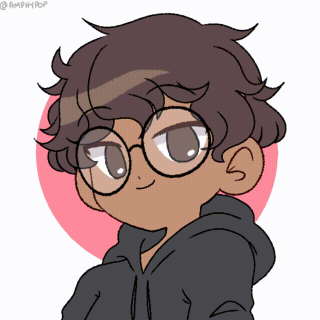

  <!-- Typing SVG by DenverCoder1 - https://github.com/DenverCoder1/readme-typing-svg -->
  

<h2>👦🏾 Quem eu sou?</h2>

  

    
"Sic Parvis Magna - A grandiosidade vem das pequenas coisas" - Francis Drake

  

    Olá, meu nome é Lucas Alcântara, e atualmente estou cursando o 1º semestre de Sistemas de Informação na Estácio Fortaleza. Tenho o objetivo de me manter sempre atualizado e conectado com o mercado de tecnologia, compartilhando minhas conquistas e aprendizados até o momento. Acredito que esse processo de troca de conhecimento é fundamental tanto para o meu crescimento acadêmico quanto profissional.

Estou em busca de oportunidades para aplicar e expandir meus conhecimentos em projetos práticos, além de contribuir para equipes que compartilham do meu entusiasmo pela inovação e resolução de problemas. Meu foco é agregar valor ao meu currículo e desenvolver habilidades que me tornem um profissional cada vez mais completo e preparado para os desafios da área.

<h2>🛠️ Minhas Habilidades</h2>
<h3>Conhecimentos:</h3>

<h4>Front-End:</h4>

<h4>Back-End:</h4>

<h4>Criatividade:<h4>

<h3>Redes Sociais:</h3>

// 
